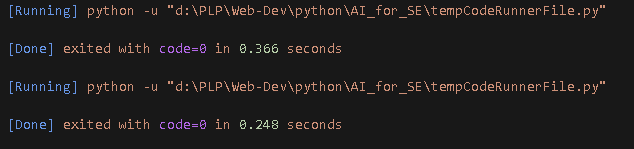
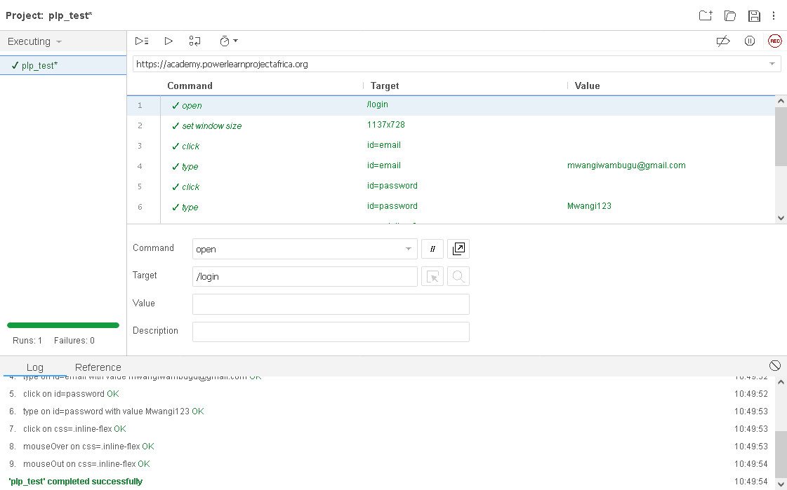
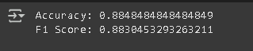

# AI for Software Engineering
This repository consists of theoretical analysis of Ai driven generation tools, AI in DevOps, automated testing with AI and predictive analysis of breast cancer.

## AI driven generation tools
In this case we were looking into the time complexity of manually coded lines vs. copilot generated code. In this instance we find that AI helps with the time taken to code and the run time of the code. It is a useful tool but it is also prone to errors and still need human eyes to debug.

##  AI in DevOPs

AIOps (Artificial Intelligence for IT Operations) aids in the efficiency of software deployment by automating the more complex processes; which will result in less reliance on manual processes and better, speedier decision-making within the software development and release process. AIOps leverages real-time operations data by continuously analyzing massive amounts of operational data to provide an always-on way to identify potential issues, predict failures, and recommend suitable deployment pathways; to facilitate a proactive, rather than reactive response.

## Automated testing with AI using Selenium IDE.

Selenium IDe is commonly used to simulate user actions such as clicking buttons, filling forms, and navigating between pages, enabling developers and testers to verify that web applications behave as expected under various conditions.

## Predictive Analysis of Breast Cancer using Random Forest Tree.

### Introduction
Predictive models, such as Random Forest classifiers, are increasingly used in healthcare to assist in cancer screening—particularly in distinguishing between benign and malignant tumors. While these models offer promising support for clinicians, they can introduce or amplify biases if the underlying data is flawed.

The dataset comes from  https://www.kaggle.com/competitions/iuss-23-24-automatic-diagnosis-breast-cancer/data

### Problem Statement
Breast cancer remains one of the leading causes of cancer-related deaths among women worldwide. Early detection significantly improves the chances of successful treatment and survival. However, traditional screening methods, such as mammography and biopsy, are often time-consuming, resource-intensive, and subject to human error. Additionally, disparities in healthcare access and diagnostic accuracy can lead to delayed or incorrect diagnoses, particularly in underrepresented or underserved populations. There is a critical need for reliable, automated systems that can assist in accurately classifying breast cancer cases as benign or malignant based on medical imaging. Developing an effective machine learning model to support early diagnosis could enhance clinical decision-making, reduce diagnostic errors, and ultimately save lives.

### Data Analysis
The training set contains two folders, corresponding to the "benign" and "malignant" classes of interest. This folder separation provides information regarding the label of each study (which is also the target of our predictions).

## Conclusions.

The predictive analysis of breast cancer using Random Forest classifier yielded an accuracy of approximately 88.48% and an F1 score of 88.30%, as shown in the model evaluation results. These metrics indicate strong performance in distinguishing between benign and malignant cases, suggesting the model has learned meaningful patterns from the dataset.

This level of accuracy implies that the model can correctly predict nearly 9 out of 10 cases, which is promising for assisting radiologists or clinicians in early detection. The high F1 score also confirms that the model balances both precision (correctly identifying malignant cases) and recall (detecting all actual malignant cases), which is critical in cancer diagnostics where missing a positive case can have severe consequences.

Such predictive tools are valuable in reducing diagnostic errors, speeding up screening processes, and supporting decision-making, especially in areas with limited access to specialists. However, before deployment in real clinical settings, it's essential to address dataset biases, validate the model on diverse populations, and integrate explainability and fairness frameworks to ensure ethical, safe, and effective use in healthcare.
